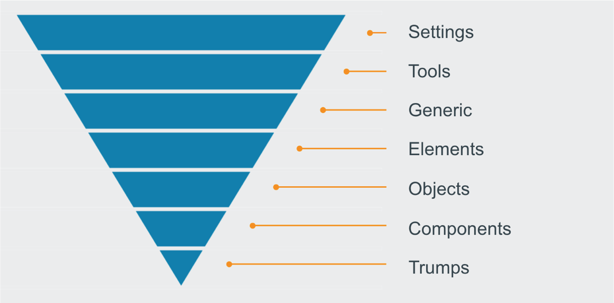

# EUYS Shared Styles

> Shared Styles, ölçeklenebilir ve sürdürülebilir bir CSS mimarisi oluşturmak için [ITCSS](https://www.xfive.co/blog/itcss-scalable-maintainable-css-architecture/) metodolojisini kullanır. Proje CSS dosyalarınızı, global ad alanı, kademeli ve seçicilerin özgünlüğü gibi CSS özellikleriyle daha iyi bir şekilde düzenlemenize yardımcı olur. 

 

## ITCSS nedir?

ITCSS'nin ana fikri, CSS kod tabanınızı, ters çevrilmiş bir üçgenin bölümleri olarak temsil edilebilecek birkaç bölüme (katman adı verilen) ayırmasıdır:

 

  - ***Settings*** – ön işlemcilerle kullanılır ve yazı tipi, renk tanımları vb. içerir.
  - ***Tools*** – küresel olarak kullanılan **@mixin** ve **@function**. İlk 2 katmanda herhangi bir CSS çıktısı almamak önemlidir.
  - ***Generic*** – [reset](https://meyerweb.com/eric/tools/css/reset/) ve/veya [normalize](https://necolas.github.io/normalize.css/) stilleri, `box-sizing` tanımını vb. Bu, gerçek CSS'yi oluşturan ilk katmandır.
  - ***Elements*** – yalın HTML öğeleri için stil oluşturma (`h1`, `a`, vb. gibi). Bunlar, tarayıcıdan varsayılan stille gelir, böylece onları burada yeniden tanımlayabiliriz.
  - ***Objects*** – örneğin [OOCSS](https://github.com/stubbornella/oocss/wiki/Content)'den bilinen medya nesnesi gibi dekore edilmemiş tasarım modellerini tanımlayan sınıf tabanlı seçiciler.
  - ***Components*** – Çalışmalarımızın çoğu burada gerçekleşiyor. Genellikle **Objects** ve **Compoents** ile UI bileşenlerini oluştururuz.
  - ***Utilities*** – üçgende daha önce gelen her şeyi geçersiz kılma yeteneğine sahip yardımcı programlar ve yardımcı sınıflar.